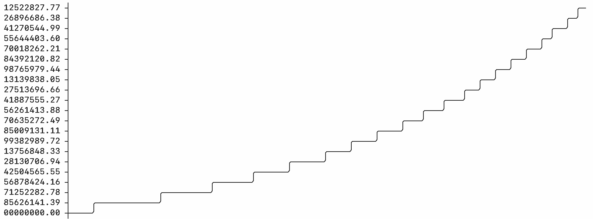
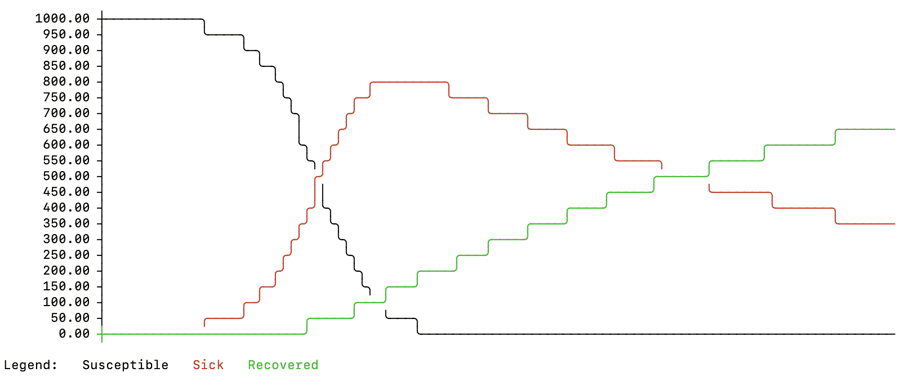
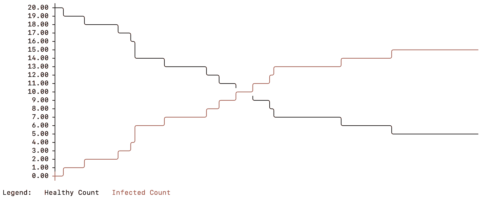
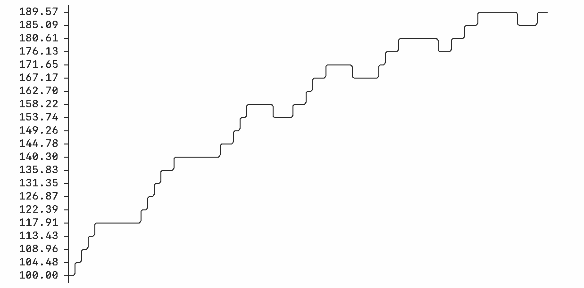
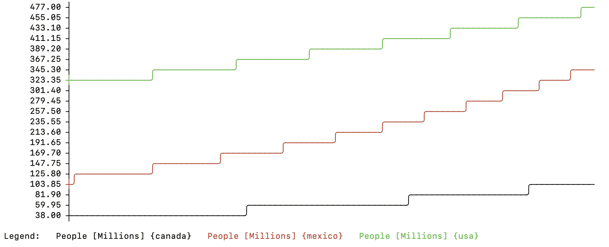

# `simulation` - Simulation and modeling for Node and the browser

`simulation` is a multi-method simulation package for Node or the browser. Use it to create models for the environment, business, or other areas. For example, it can be used to create models of disease spread, population growth, or the adoption of a product in the marketplace.

`simulation` supports differential equation models (also called System Dynamics models) in addition to Agent Based Models, or any mixture of the two techniques.

In addition to building models directly with the package, `simulation` also supports importing and running models built with [Insight Maker](https://insightmaker.com).

## Installing the package

### Installation with NPM

Node installation:

```shell
npm install --save simulation
```

The rest of this README will assume you are using `simulation` in Node with ES6 module syntax.

In the README, we will also be using the optional `simulation-viz-console` package to visualize results in a console. It may be installed with:

```shell
npm install --save simulation-viz-console
```

### Directly importing the modules

You can also import `simulation` ES6 modules directly from the source code without using NPM:

```javascript
import { Model } from "simulation/src/api/Model.js";
```

The code will work without transpilation in modern browsers.

## Example usage

### Our first simulation model

Let's create a simulation model of the world population over the next 100 years. Start by importing the `simulation` and `simulation-viz-console` packages.

```javascript
import { Model } from "simulation";
import { table, plot } from "simulation-viz-console";
```

**Tip: If you get the error `SyntaxError: Cannot use import statement outside a module` when running this in Node, add `"type": "module"` to your `package.json` or change your file extension from `.js` to `.mjs`. See [here](https://nodejs.org/api/esm.html#enabling) for more information.**

Next, we initialize a model:

```javascript
let m = new Model({
  timeStart: 2020,
  timeLength: 100,
  timeUnits: "Years"
});
```

**Tip: Use VSCode or another editor that supports JSDoc type annotations. `simulation` makes extensive use of type annotations to indicate available options. Add `// @ts-check` to the top of a JavaScript file in VSCode to enable automatic type checking of the code, this will help catch errors.**

This creates a model that will simulate 100 years, starting at the year 2020.

`simulation` models are composed out of building blocks called "primitives". In this model we're going to use three primitives:

* A **Stock** to store the number of people in the world population. Generally, stocks store things like people, dollars, water, or anything else
* A **Flow** to define the change in the population stock. Flows model the movement of material between stocks.
* A **Variable** to define the net growth rate for the population. In this model, that will be a constant value, but it could also be a dynamic equation.

```javascript
// Start with 7 billion people in the "people" stock
let people = m.Stock({
  name: "People",
  initial: 7e9
});

// Use a net growth rate of 2% a year
let growthRate = m.Variable({
  name: "Growth Rate",
  value: 0.02
});

// The population growth each year is the number of people times the growth rate
// Please note that we refer to the value of other primitives in the model with the
// [name] syntax.
let netGrowth = m.Flow(null, people, {
  rate: "[People] * [Growth Rate]"
});

// For the netGrowth flow to be able to reference the growthRate, we need to link the primitives
m.Link(growthRate, netGrowth);
```

We've set up our model, now take a look at the results:

```javascript
let results = m.simulate();

table(results, people);
plot(results, people);
```

Which outputs:

```
╔══════════════╤════════════════╗
║ Time [years] │         People ║
╟──────────────┼────────────────╢
║         2020 │  7000000000.00 ║
║         2021 │  7140000000.00 ║
║         2022 │  7282800000.00 ║
...
║         2118 │ 48743293759.87 ║
║         2119 │ 49718159635.07 ║
║         2120 │ 50712522827.77 ║
╚══════════════╧════════════════╝
```



Putting it all together we get the following. You can copy this into a `main.js` file, and run it with `node main.js`:

```javascript
import { Model } from "simulation";
import { table, plot } from "simulation-viz-console";


let m = new Model({
  timeStart: 2020,
  timeLength: 100,
  timeUnits: "Years"
});

// Start with 7 billion people in the "people" stock
let people = m.Stock({
  name: "People",
  initial: 7e9
});

// Use a net growth rate of 2% a year
let growthRate = m.Variable({
  name: "Growth Rate",
  value: 0.02
});

// The population growth each year is the number of people times the growth rate
// Please note that we refer to the value of other primitives in the model with the
// [name] syntax.
let netGrowth = m.Flow(null, people, {
  rate: "[People] * [Growth Rate]"
});

// For the netGrowth flow to be able to reference the growthRate, we need to link the primitives
m.Link(growthRate, netGrowth);


let results = m.simulate();

table(results, people);
plot(results, people);
```

### Modeling the spread of a disease

Let's now look at a more complex model: disease spread. One simple way to model the spread of a disease is to assume there are three categories of people:

* **Susceptible** people who are healthy and can be infected,
* **Infected** people who are sick and spreading the disease,
* and, **Recovered** people who were infected but are now better. We'll also assume recovered people and are now immune to the disease.

We'll use three stocks to represent these categories, and we'll use flows to move people between them.

```javascript
import { Model } from "simulation";
import { table, plot } from "simulation-viz-console";


let m = new Model();

// Start with 1,000 healthy, susceptible people
let s = m.Stock({
  name: "Susceptible",
  initial: 1000
});

// One infected person
let i = m.Stock({
  name: "Infected",
  initial: 1
});

// And no recovered people
let r = m.Stock({
  name: "Recovered",
  initial: 0
});


// The number of people becoming sick is the product of the
// healthy and sick people times a constant.

m.Flow(s, i, {
  name: "Infection",
  rate: "[Susceptible] * [Infected] * 0.0003"
});


// People recover at a fixed rate

m.Flow(i, r, {
  name: "Recovery",
  rate: "[Infected] * 0.015"
});


plot(m.simulate(), [s, i, r]);
```

Taking a look at the results for this model. We can see there is an initial spike in infections that declines as people move to the *Recovered*, immune state.





### Modeling disease with agents

The models we have looked at so far are System Dynamics differential equation models. They assume average changes across a continuous population. In reality though, when looking at the spread of disease you have many distinct individuals and interactions.

The `simulation` package supports Agent Based Modeling for cases where you want to simulate events at the level of an individual rather than in aggregate.

For this model, we're going to use a couple new types of primitives:

* **Agent** We'll use an Agent primitive to define what a "person" is in our model. When the model runs, a separate agent will be created for each person, and it will contain all the properties for that person.
* **Population** A population represents a collection of agents with a given Agent definition. We'll have a population of 20 people in this example.
* **State** A State represents a boolean condition. For example sick/not-sick, employed/not-employed, etc. We'll use these to represent whether our agents are healthy or sick.
* **Transition** A Transition moves agents between states. For example, you could have a model with "Employed" and "Unemployed" states. When a person is hired, they are transitioned from the unemployed to the employed states. We'll use a transition to move agents between health states. 

```javascript
import { Model } from "simulation";
import { table, plot } from "simulation-viz-console";


let m = new Model();

// Define the person agent for our model
let person = m.Agent({
  name: "Person"
});

// Add a healthy state to the person agent, our agents
// will all start healthy.
//
// Note we use `person.State` rather than `m.State` to add the state
// to the agent definition, not to the model in general.
let healthyState = person.State({
  name: "Healthy",
  startActive: true
});

// Add an infected state to our person agent. For each agent
// it will start with the opposite value of that agent's healthy
// state.
let infectedState = person.State({
  name: "Infected",
  startActive: "not [Healthy]"
});

// Since the Infected state uses the Healthy state in its equation,
// we need to explicitly link them
person.Link(healthyState, infectedState);

// Add a transition to convert people from the Healthy to Infected states.
// You can have a variety of different transition conditions. Here, we'll
// use a simple 2% chance of transitioning each time period.
person.Transition(healthyState, infectedState, {
  trigger: "Probability",
  value: 0.02
});


// Create a population of 20 person agents
let population = m.Population({
  name: "Population",
  populationSize: 20,
  agentBase: person
});

// The population needs to reference the person agent so we
// explicitly link them
m.Link(person, population);

// Create summary statistics for our simulation that count up the number
// of healthy and infected people
let healthyCount = m.Variable({
  name: "Healthy Count",
  value: "[Population].FindState([Healthy]).Count()"
});
m.Link(population, healthyCount);


let infectedCount = m.Variable({
  name: "Infected Count",
  value: "[Population].FindState([Infected]).Count()"
});
m.Link(population, infectedCount);


plot(m.simulate(), [healthyCount, infectedCount]);
```

Here are typical results you might see:



### Using units in models

Most models are of a physical system and each primitive has units. For example in our disease or population models, the stocks have units of "People", and the flow rates have units of "People/Year" (or some other time units).

In our models above, this was implicit. However, it can be useful to explicitly specify the units for each primitive in your model. When you do, `simulation` will check the units during the simulation to ensure they aren't violated. This typing can help prevent bugs in your models.

`simulation` has a large number of common units built-in, but you can also define your own custom units.

Let's look at a quick example that models the water level in a lake. Here `simulation` checks the units in the model and also transparently converts between units like `acre feet`, `gallons`, `months`, `years` and `hours`.

Also note the use of `{4 year}` in the evaporation equation. The `{123 units}` syntax allows you to use numbers with units directly in your equations. So you can do things like `{10 people}` or `{10 people/year^2}`.


```javascript
import { Model } from "simulation";
import { table, plot } from "simulation-viz-console";


let m = new Model({
  timeUnits: "Months",
  timeLength: 72
});

// Model a lake's water volume as a stock
let lake = m.Stock({
  name: "Lake",
  initial: 100,
  units: "acre feet"
});

// A river flowing into the lake is modeled as a flow
let river = m.Flow(null, lake, {
  name: "Inflow River",
  rate: "1000 * (seasonal() + 2)", // the seasonal() function creates a sine wave over the course of the year, representing different rates of evaporation in summer vs winter
  units: "gallons / hour"
});

// Evaporation from the lake is also modelled as a flow
let evaporation = m.Flow(lake, null, {
  name: "Evaporation",
  rate: "[Lake] / {4 year}", // 1/4 of the lake's volume evaporates per year
  units: "acre feet / year"
});

let results = m.simulate();

table(results, [lake, river, evaporation]);
plot(results, lake);
```

Outputs:

```
╔═══════════════╤══════════════════╤═══════════════════════════════╤════════════════════════════════╗
║ Time [months] │ Lake [acre feet] │ Inflow River [gallons / hour] │ Evaporation [acre feet / year] ║
╟───────────────┼──────────────────┼───────────────────────────────┼────────────────────────────────╢
║             0 │           100.00 │                       3000.00 │                          25.00 ║
║             1 │           104.64 │                       2866.03 │                          26.16 ║
║             2 │           108.88 │                       2500.00 │                          27.22 ║
...
║            70 │           184.74 │                       2500.00 │                          46.18 ║
║            71 │           186.49 │                       2866.03 │                          46.62 ║
║            72 │           189.03 │                       3000.00 │                          47.26 ║
╚═══════════════╧══════════════════╧═══════════════════════════════╧════════════════════════════════╝
```



### Using vectors in your model

Let's revisit the population model from earlier. What if we wanted to simulate the population growth for the world but also break it down by country?

We could do this by creating a separate stock and flow for each country, but that would become tedious (and inefficient).

Instead, `simulation` supports vectors. Vectors can be used in place of regular scalar values in your models. They are denoted with curly brackets.

For example, `{1, 2, 3} * {1, 2, 3}` will return `{1, 4, 9}`. You can also name the elements of a vector. For example, `{cats: 10, dogs: 2} * {dogs: 3, cats: 20}` will return `{dogs: 6, cats: 200}`.

Using vectors, we can modify our population model above to simulate individual countries in North America without changing the model structure. We just need to define country specific populations and growth rates using vectors. We'll add some units to our model too:


```javascript
import { Model } from "simulation";
import { plot } from "simulation-viz-console";


let m = new Model({
  timeStart: 2020,
  timeLength: 100,
  timeUnits: "Years"
});

let people = m.Stock({
  name: "People",
  initial: "{usa: 320, canada: 38, mexico: 120}",
  units: "Millions"
});


let growthRate = m.Variable({
  name: "Growth Rate",
  value: "{usa: 0.004, canada: 0.011, mexico: 0.011}",
  units: "1 / Years"
});

let netGrowth = m.Flow(null, people, {
  rate: "[People] * [Growth Rate]",
  units: "Millions / Year"
});

m.Link(growthRate, netGrowth);


plot(m.simulate(), [people]);
```



## Equations

`simulation` uses a DSL for its equations. This allows us to cleanly implement features like built-in units and vectors.

Values of other primitives are referenced with the notation `[Primitive Name]`. When referencing a primitive, the primitives must either be connected directly (e.g. a flow connected to a stock) or connected via a link (e.g. `Model.link(referencedPrimitive, referencingPrimitive)`).

Numbers with units may be defined with curly brackets. For example `{1 meters} * {200 centimeters}` (evaluates to 2 square meters).

The equation language supports common operators. `+`, `-`, `/`, `*`, `^`, `%` for mathematics (scalar and vector). `=`, `<>`, `>`, `<`, `<=`, `>=` for comparison (note that equality and inequality are `=` and `<>` respectively). `and`, `or`, `not` for boolean logic. `+` for string concatenation.

Local variables are supported in equations:

```
z <- [x] + 1 # the arrow operator (<-) is used for assignment
z * 2 # The last evaluated value is returned automatically for multi-line equations
```

Comments are supported:

```
# this is comment

// so is this

/*
multi-line
comment
*/
```

Conditionals are supported:

```
if [x] > 10 then
  100
else if [x] > 5 then
  50
else
  10
end if
```

Looping is supported:

```
x <- 1
while x < 10
  x <- x + 1
end loop
x
```

```
sum <- 0
for x from 1 to 10
   sum <- sum + x
end loop
sum
```

Custom functions may also be defined:

```
function add(x, y)
  x + y
end function

add(1, 2)
```

### Built-in functions

See here for a list of built-in functions:

https://insightmaker.com/functions


## Simulation algorithms

`simulation` uses a numerical solver to evaluate the differential equations in the model. It supports two solvers: Euler's method and a 4th order Runge Kutta solver.

Each solver is parameterized by the simulation time step. You can configure them on your model instance:

```javascript
let m = new Model({
    algorithm: "RK4",
    timeStep: 1
});
```

```javascript
let m = new Model({
    algorithm: "Euler",
    timeStep: 0.1
});
```

Euler's method is the simpler of the two methods. It evaluates all the flow rates at the start of the simulation. It then moves the simulation forward by the `timeStep` you specified using those rates. It then reevaluates the flows. It repeats this process until it reaches the end of the simulation.

The 4th order Runge Kutta method is more complex and requires four different flow rate evaluations for each time step. These four rates are averaged to get the final flow rate which is used to move the simulation forward by the time step.

Model accuracy may be increased by decreasing the time step (at the cost of increased computation). Cutting the time step in half will double the computation required. Between the two methods, Runge Kutta is more accurate per unit of computation than Euler's method. The exception is if your model contains sharp discontinuities in flow rates (like step functions), in which case the averaging behavior in the Runge Kutta method may not be desirable.


## Importing models from InsightMaker.com

`simulation` supports importing and running models built with [Insight Maker](https://insightmaker.com).

First export your model from Insight Maker from the `Share` menu.

Then, you can use:

```javascript
import { loadInsightMaker } from "simulation";

let model = loadInsightMaker("<Model Text....>");

// You may modify the loaded model before running it

// In this case we'll change the value of the variable primitive "Growth Rate"
let rate = model.getVariable(v => v.name === "Growth Rate");

// Give it a random value between 0 and 3;
rate.value = Math.random() * 3;

// run the simulation
let results = model.simulate();
```

# Citation

If you use this package in your published research, please cite:

```
@article{FORTMANNROE201428,
title = {Insight Maker: A general-purpose tool for web-based modeling & simulation},
journal = {Simulation Modelling Practice and Theory},
volume = {47},
pages = {28-45},
year = {2014},
issn = {1569-190X},
doi = {https://doi.org/10.1016/j.simpat.2014.03.013},
url = {https://www.sciencedirect.com/science/article/pii/S1569190X14000513},
author = {Scott Fortmann-Roe},
keywords = {Modeling, Simulation, Web-based technologies, System Dynamics, Agent-Based Modeling},
abstract = {A web-based, general-purpose simulation and modeling tool is presented in this paper. The tool, Insight Maker, has been designed to make modeling and simulation accessible to a wider audience of users. Insight Maker integrates three general modeling approaches – System Dynamics, Agent-Based Modeling, and imperative programming – in a unified modeling framework. The environment provides a graphical model construction interface that is implemented purely in client-side code that runs on users’ machines. Advanced features, such as model scripting and an optimization tool, are also described. Insight Maker, under development for several years, has gained significant adoption with currently more than 20,000 registered users. In addition to detailing the tool and its guiding philosophy, this first paper on Insight Maker describes lessons learned from the development of a complex web-based simulation and modeling tool.}
}
```

# License

Distributed under the AGPL License. See [LICENSE](LICENSE) for more information.
